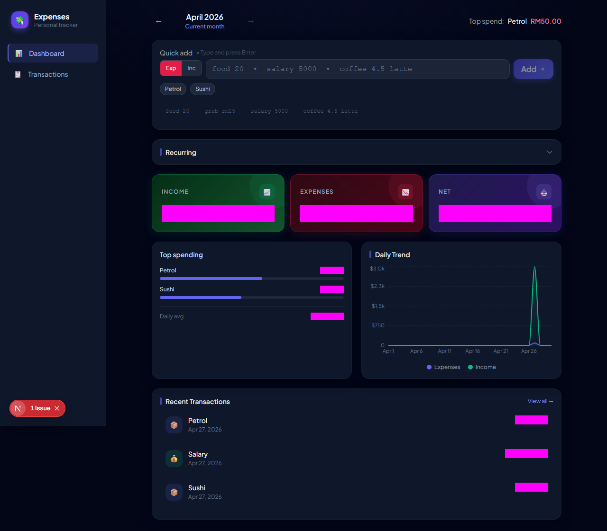
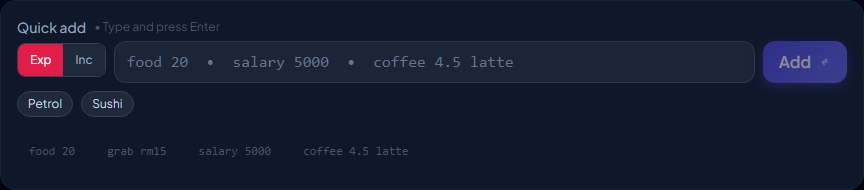
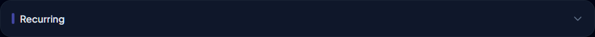
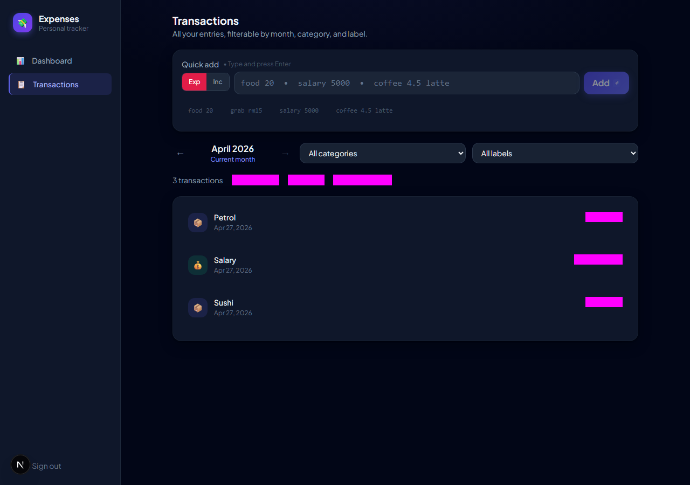
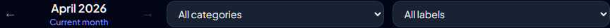
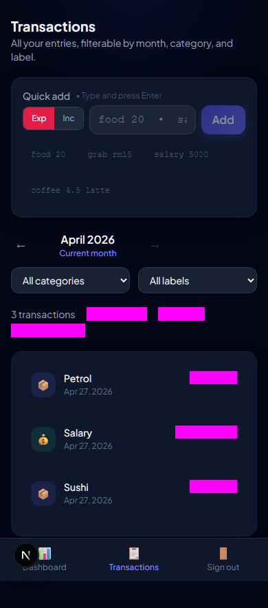
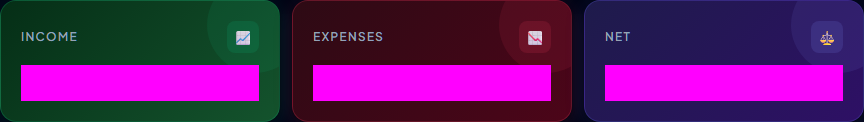
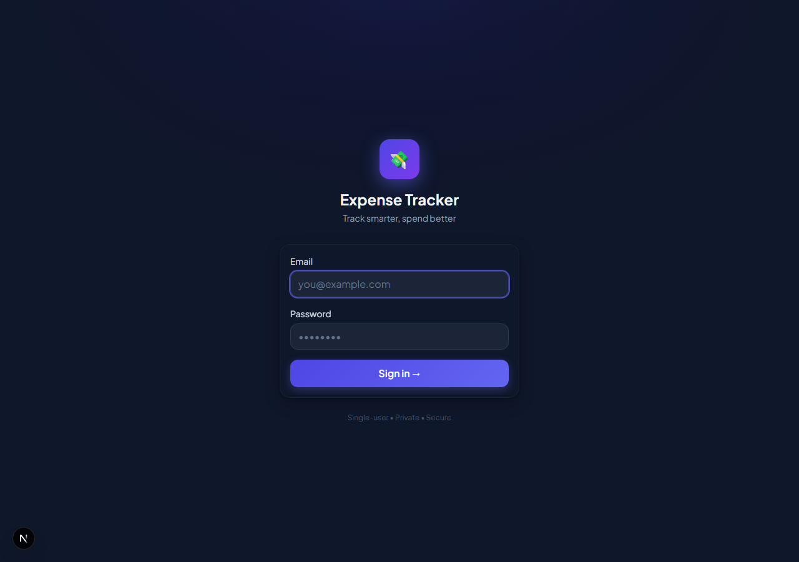
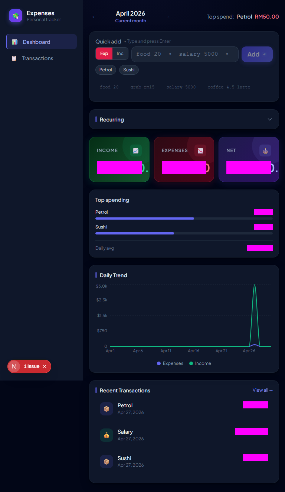
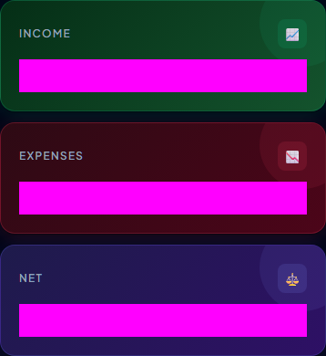

import { Image } from 'astro:assets';

I'd been tracking expenses in a spreadsheet for years. It worked until it didn't — the friction of opening a tab on mobile meant I'd forget purchases and the data was always half-wrong by month's end. So I built something custom.

What started as a weekend thing turned into a longer exploration than I expected. The natural language input came together fast. The offline sync did not. This is a writeup of how it's built and what gave me trouble along the way.

---

## What it does


*Dashboard — stat cards, daily trend, category breakdown, recent transactions.*

The main features I cared about:
- **Natural language quick-add** — type `coffee 4.50 starbucks #work` and it parses category, amount, note, and labels
- **Offline-first** — add transactions with no internet; they sync when back online
- **Recurring transactions** — rules for monthly rent, weekly subscriptions, etc.
- **Analytics** — month-over-month comparison, category breakdown, daily trend
- **Labels** — `#tag` syntax with filtering
- **PWA** — installable on iOS and Android

---

## Stack

```
Next.js 15 (App Router)    ← framework
React 18                   ← UI
Prisma + PostgreSQL (Neon) ← database
NextAuth v4                ← authentication
Tailwind CSS               ← styling
Recharts                   ← charts
IndexedDB (idb@8)          ← offline storage
Service Worker             ← background sync
Playwright                 ← visual regression tests
```

I went with Next.js 15 for the App Router's server component model — fetch on the server, pass as initial props, then let the client manage live state. Prisma because the generated types make refactoring safe. Neon for a serverless Postgres instance that plays well with Vercel's connection pooling.

---

## Project structure

```
expense-tracker/
├── app/
│   ├── (auth)/login/
│   ├── (dashboard)/
│   │   ├── dashboard/         # Server component
│   │   └── transactions/      # Client-side, refetches on filter change
│   └── api/
│       ├── auth/[...nextauth]/
│       └── sync/route.ts      # REST endpoint for offline sync
├── components/
│   ├── DashboardContent.tsx   # Central client component
│   ├── ExpenseInput.tsx       # Quick-add input
│   ├── TransactionList.tsx
│   ├── SyncStatusBar.tsx
│   └── recurring/
├── context/
│   └── SyncProvider.tsx       # Online state + sync orchestration
├── lib/
│   ├── actions.ts             # Server actions (DB access)
│   ├── parser.ts              # Natural language → structured data
│   ├── idb.ts                 # IndexedDB wrapper
│   ├── sync.ts                # Offline sync logic
│   └── utils.ts
├── prisma/schema.prisma
├── public/sw.js               # Service worker
└── e2e/                       # Playwright visual tests
```

---

## Database schema

```prisma
model Transaction {
  id        String   @id @default(cuid())
  userId    String
  amount    Float    // always positive — direction set by `type`
  category  String
  note      String?
  date      DateTime @default(now())
  type      String   // "income" | "expense"
  labels    String[] @default([])
  createdAt DateTime @default(now())
  updatedAt DateTime @updatedAt

  @@index([userId])
  @@index([userId, date])
}

model RecurringTransaction {
  id        String    @id @default(cuid())
  userId    String
  name      String
  category  String
  amount    Float
  type      String    // "income" | "expense"
  frequency String    // "daily" | "weekly" | "monthly" | "yearly"
  startDate DateTime
  endDate   DateTime?
  lastRun   DateTime?
  isActive  Boolean   @default(true)
}

model Category {
  id        String   @id @default(cuid())
  userId    String
  name      String
  icon      String   @default("📦")
  color     String   @default("#6366f1")
  isDefault Boolean  @default(false)

  @@unique([userId, name])
}
```

A few decisions worth noting:

- **`amount` is always positive.** Direction comes from `type`. Makes `SUM` queries for income vs expense clean and removes any ambiguity about sign conventions.
- **`labels` as a Postgres array.** `String[]` on PostgreSQL with Prisma avoids a join table for what's essentially a simple tagging feature. Filtering is `{ labels: { has: label } }`.
- **Compound index on `[userId, date]`.** Almost every query filters by user and sorts by date.

---

## Data flow

The architecture uses server components for the initial fetch, then hands off to a client component for mutations and live state.

```
┌─────────────────────────────────────────────────────────────────────┐
│                     Request: /dashboard?month=2026-04               │
└─────────────────────────────────────┬───────────────────────────────┘
                                      │
                          ┌───────────▼───────────┐
                          │  dashboard/page.tsx    │
                          │  (Server Component)    │
                          │                        │
                          │  getDashboardData()    │
                          │  getRecurringTx()      │
                          │  ← both in parallel    │
                          └───────────┬───────────┘
                                      │ passes initial* props
                          ┌───────────▼───────────┐
                          │  DashboardContent.tsx  │
                          │  (Client Component)    │
                          │                        │
                          │  useState(initialData) │
                          │  handles add/edit/del  │
                          │  optimistic updates    │
                          └───────────────────────┘
```

After a mutation, `DashboardContent` updates all affected state locally — transactions, totals, category breakdown — so the UI reflects the change immediately. No `router.refresh()` call on every add.

```tsx
// app/(dashboard)/dashboard/page.tsx
export default async function DashboardPage({ searchParams }) {
  const { month } = await searchParams;
  const [dashboardData, recurring] = await Promise.all([
    getDashboardData(month),
    getRecurringTransactions(),
  ]);

  return (
    <DashboardContent
      initialTransactions={dashboardData.transactions}
      initialIncome={dashboardData.totalIncome}
      initialExpenses={dashboardData.totalExpenses}
      initialRecurring={recurring}
      // ... more props
    />
  );
}
```

---

## Natural language input

The part I'm most happy with. Instead of a form, there's a single text input:

```
coffee 4.50 starbucks
salary 5000 #work
grab rm15 #transport
food 20 #date #house
```

The parser in `lib/parser.ts` is about 100 lines. No ML, no regex soup — just token manipulation:

```typescript
export function parseExpenseInput(input: string): ParsedExpense | null {
  const tokens = input.trim().split(/\s+/);

  // Find the first token that looks like a number
  let amountIndex = -1;
  let amount = 0;
  for (let i = 0; i < tokens.length; i++) {
    const val = extractNumericValue(tokens[i]); // strips "rm", "$", etc.
    if (val !== null) {
      amount = val;
      amountIndex = i;
      break;
    }
  }

  // Everything before the number = category
  // Everything after = note tokens and #labels
  const categoryTokens = tokens.slice(0, amountIndex);
  const afterAmount = tokens.slice(amountIndex + 1);

  const labels: string[] = [];
  const noteTokens: string[] = [];
  for (const tok of afterAmount) {
    if (tok.startsWith("#") && tok.length > 1) {
      labels.push(tok.slice(1).toLowerCase());
    } else {
      noteTokens.push(tok);
    }
  }

  // Infer income vs expense from first word
  const firstWord = (categoryTokens[0] ?? "").toLowerCase();
  const type = INCOME_KEYWORDS.has(firstWord) ? "income" : "expense";

  return {
    category: categoryTokens.join(" "),
    amount,
    type,
    note: noteTokens.join(" ") || undefined,
    labels,
  };
}
```

`INCOME_KEYWORDS` covers things like `salary`, `freelance`, `dividend`, `cashback`, `refund`. There's also an **Exp / Inc** toggle for when the parser guesses wrong.


*Live parse preview as you type.*

---

## Offline-first

This took longer than anything else. I wanted it to work on the train, in basements, in areas with flaky connectivity. The solution ended up being three layers.

### IndexedDB

`lib/idb.ts` wraps IndexedDB with two stores:

```typescript
interface LocalTransaction {
  id: string;           // "cuid..." when synced, "pending_..." when offline
  userId: string;
  category: string;
  amount: number;
  type: "income" | "expense";
  labels: string[];
  date: string;
  syncStatus: "synced" | "pending" | "pending-update" | "pending-delete";
  syncError?: string;
}

interface QueuedOp {
  queueId: number;      // autoIncrement — preserves causal order
  op: "add" | "update" | "delete";
  tempId: string;
  payload: Record<string, unknown>;
  createdAt: string;
}
```

Every transaction is mirrored locally. When added offline, it gets a `pending_${timestamp}_${random}` temp ID and `syncStatus: "pending"`.

### The sync queue

`lib/sync.ts` has two main functions.

**`applyLocalMutation(op, data)`** — writes to IDB and enqueues an operation:

```typescript
async function applyLocalMutation(op, data) {
  if (op === "add") {
    const tempId = `pending_${Date.now()}_${Math.random().toString(36).slice(2)}`;
    await putTransaction({ ...data, id: tempId, syncStatus: "pending" });
    await enqueueOp({ op: "add", tempId, payload: data });
    return { committed: localTx, wasQueued: true };
  }

  if (op === "update") {
    // If the record is still "pending" (never synced), update the ADD op in-place
    // rather than queueing a separate UPDATE — avoids orphaned operations
    const existing = await getTransactionFromIDB(data.id);
    if (existing.syncStatus === "pending") {
      await updateQueuedOp({ ...addOp, payload: { ...addOp.payload, ...data } });
    } else {
      await enqueueOp({ op: "update", tempId: data.id, payload: data });
    }
  }
}
```

The update case took some thought: if a transaction was added offline and then edited offline, queueing `ADD` + `UPDATE` would cause a server error when the `UPDATE` runs before the `ADD` is confirmed. Mutating the `ADD` payload in-place avoids that.

**`drainQueue()`** — processes ops in insertion order, stops on first failure:

```typescript
async function drainQueue() {
  const ops = await getOps(); // ordered by queueId (autoIncrement)
  const tempIdMap = new Map(); // tracks ADD result IDs within this drain run

  for (const op of ops) {
    const resolvedId = tempIdMap.get(op.tempId) ?? op.tempId;
    try {
      if (op.op === "add") {
        const res = await fetch("/api/sync", { method: "POST", body: JSON.stringify({ op: "add", payload: op.payload }) });
        const { id: realId } = await res.json();
        tempIdMap.set(op.tempId, realId);
        await replaceTempId(op.tempId, realId); // atomic IDB transaction
      }
      // ... update, delete handlers
      await deleteQueuedOp(op.queueId);
    } catch {
      break; // stop — next op might depend on this one
    }
  }
}
```

`replaceTempId` is an atomic IDB transaction that replaces the temp ID in the `transactions` store and also updates any following queue entries referencing the old temp ID — prevents a stale ID being used in a later UPDATE.

### The full offline flow

```
User adds "food 20" with no network
         │
         ▼
  ExpenseInput checks isOnline === false
         │
         ▼
  applyLocalMutation("add", {...})
         │
         ├──► IDB transactions: { id: "pending_1234", syncStatus: "pending" }
         │
         └──► IDB syncQueue:    { queueId: 1, op: "add", tempId: "pending_1234" }
         │
         ▼
  Transaction appears with amber "Pending" badge

         [... page reload, still offline ...]

  DashboardContent mounts → reads IDB → pending item still visible ✓

         [... network reconnects ...]

  SyncProvider: isOnline = true → syncNow()
         │
         ▼
  drainQueue() → POST /api/sync { op: "add" }
         │
         ▼
  Server returns { success: true, id: "clxyz..." }
         │
         ▼
  replaceTempId("pending_1234", "clxyz...")  ← atomic IDB update
         │
         ▼
  router.refresh() → "Pending" badge disappears ✓
```

### Service worker + BackgroundSync

For the case where the tab is closed mid-sync:

```javascript
// public/sw.js (simplified)
self.addEventListener("sync", (event) => {
  if (event.tag === "expense-sync") {
    event.waitUntil(drainQueueFromSW());
  }
});

async function drainQueueFromSW() {
  const db = await openDB("expense-tracker", 1);
  const ops = await db.getAll("syncQueue");
  for (const op of ops) {
    await fetch("/api/sync", {
      method: "POST",
      body: JSON.stringify(op),
      credentials: "same-origin",
    });
  }
}
```

`SyncProvider` registers the `"expense-sync"` BackgroundSync tag whenever `pendingCount > 0`. The browser fires the `sync` event once connectivity returns, even if the tab is already closed.

---

## Recurring transactions

Rent, subscriptions, salaries — things that happen on a fixed schedule. The `RecurringTransaction` model stores rules; status is computed at runtime:

```typescript
function getNextDueDate(frequency, startDate, lastRun): Date {
  const base = lastRun ?? startDate;
  switch (frequency) {
    case "daily":   return addDays(base, 1);
    case "weekly":  return addWeeks(base, 1);
    case "monthly": return addMonths(base, 1);
    case "yearly":  return addYears(base, 1);
  }
}

function getRecurringStatus(nextDue, endDate): "upcoming" | "due" | "overdue" | "ended" {
  if (endDate && isPast(endDate)) return "ended";
  if (isPast(nextDue)) return "overdue";
  if (isToday(nextDue) || differenceInDays(nextDue, new Date()) <= 2) return "due";
  return "upcoming";
}
```

The recurring section auto-expands on the dashboard when there are due or overdue items:



Posting is a `db.$transaction([...])` — creates the `Transaction` record and updates `lastRun` atomically.

---

## Transactions page

Unlike the dashboard (server-rendered on mount), the transactions page needs to refetch whenever filters change, so it uses `useEffect` + server actions.



Filters: month, category, label, type (income/expense).





---

## Stat cards with MoM deltas



The server fetches current and previous month in parallel:

```typescript
async function getDashboardData(month?: string) {
  const [start, end] = getMonthRange(month);
  const [prevStart, prevEnd] = getMonthRange(prevMonth(month));

  const [transactions, prevTransactions] = await Promise.all([
    db.transaction.findMany({ where: { userId, date: { gte: start, lte: end } } }),
    db.transaction.findMany({ where: { userId, date: { gte: prevStart, lte: prevEnd } } }),
  ]);

  return {
    transactions,
    totalIncome: sum(transactions, "income"),
    totalExpenses: sum(transactions, "expense"),
    prevIncome: sum(prevTransactions, "income"),
    prevExpenses: sum(prevTransactions, "expense"),
  };
}
```

---

## Labels

Added with `#tag` syntax inline. Color is deterministic from the string:

```typescript
export function stringToColor(str: string): string {
  let hash = 0;
  for (let i = 0; i < str.length; i++) {
    hash = str.charCodeAt(i) + ((hash << 5) - hash);
  }
  const hue = Math.abs(hash) % 360;
  return `hsl(${hue}, 60%, 45%)`;
}
```

Same label always gets the same color across the app.

---

## Auth

Credentials provider with bcrypt. No OAuth — this is a private single-user app.

```typescript
export const authOptions: NextAuthOptions = {
  providers: [
    CredentialsProvider({
      credentials: { email: {}, password: {} },
      async authorize(credentials) {
        const user = await db.user.findUnique({ where: { email: credentials.email } });
        if (!user) return null;
        const valid = await bcrypt.compare(credentials.password, user.passwordHash);
        return valid ? user : null;
      },
    }),
  ],
  session: { strategy: "jwt" },
};
```

Every server action calls `getAuthenticatedUserId()` which throws if the session is missing.



---

## Visual regression tests

I've caught three unintended layout regressions with these. Worth the setup time.

Playwright tests cover three viewports: mobile (390px), tablet (768px), desktop (1280px).

```typescript
// e2e/dashboard.spec.ts
test("stat cards", async ({ page }) => {
  await page.goto("/dashboard");
  await waitForReady(page);

  const cards = page.locator('[data-testid="stat-cards"]');
  await amountMasks(page); // mask currency values so amounts don't break snapshots
  await expect(cards).toHaveScreenshot("stat-cards.png");
});
```

The `amountMasks` helper overlays a gray box on all `.tabular-nums` elements so actual amounts never cause snapshot mismatches between runs.

Snapshots are committed to git. CI catches regressions on every PR.

---

## Responsive layout

| Viewport | Navigation |
|----------|-----------|
| Desktop (1280px+) | Fixed sidebar |
| Tablet (768px) | Top nav bar |
| Mobile (390px) | Bottom tab bar |





On mobile, a floating `+` button opens a bottom sheet instead of the inline quick-add input.

---

## Deployment

Vercel + Neon:

```
POSTGRES_PRISMA_URL=postgresql://...?pgbouncer=true  # pooled
POSTGRES_URL_NON_POOLING=postgresql://...            # for migrations
NEXTAUTH_SECRET=...
NEXTAUTH_URL=https://your-domain.vercel.app
ADMIN_EMAIL=...
```

Build command: `prisma generate && next build` — ensures the Prisma client is always in sync with the schema.

---

## Reflections

The offline sync was the hardest part. I started with `localStorage`, then realized I needed ordering guarantees, then atomic ID replacement, then BackgroundSync for closed-tab syncing. Each piece is simple in isolation; they compose into something genuinely complex. I kept each layer's responsibility narrow and it stayed manageable.

The optimistic update state management was also more involved than I expected. When adding a transaction you need to update six slices simultaneously: the list, total income, total expenses, net balance, category breakdown, and pending count. Routing all mutations through a single `handleAdd` function in `DashboardContent` was the only thing that kept it sane.

One React 18 gotcha: `startTransition(async fn)` doesn't work. Async functions inside `startTransition` aren't tracked as transitions. I spent an afternoon debugging this before swapping to a plain `useState` loading flag. React 19 apparently fixes it.

The natural language parser ended up being simpler than I thought it'd be. Finding the first numeric token and splitting around it handles the 95% case cleanly. The income keyword set (`salary`, `freelance`, `dividend`, `refund`, etc.) covers the edge cases that would otherwise need a type toggle.

The app actually gets used daily, which is more than I can say for the spreadsheet.
